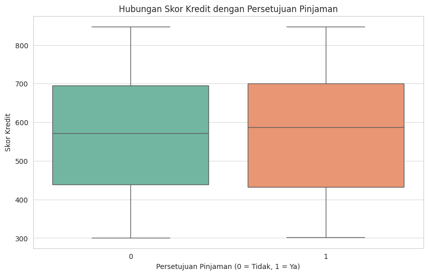
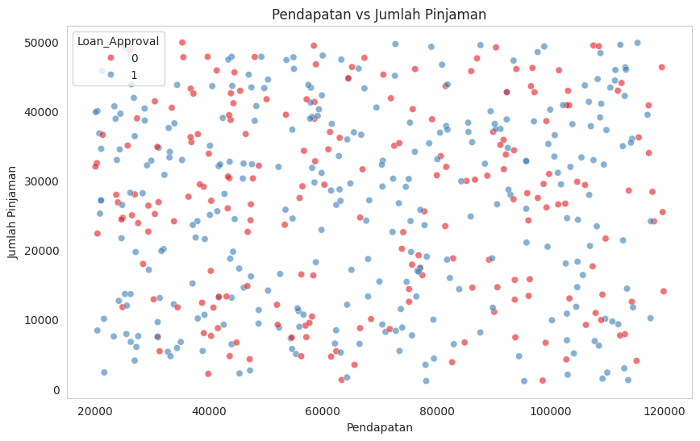
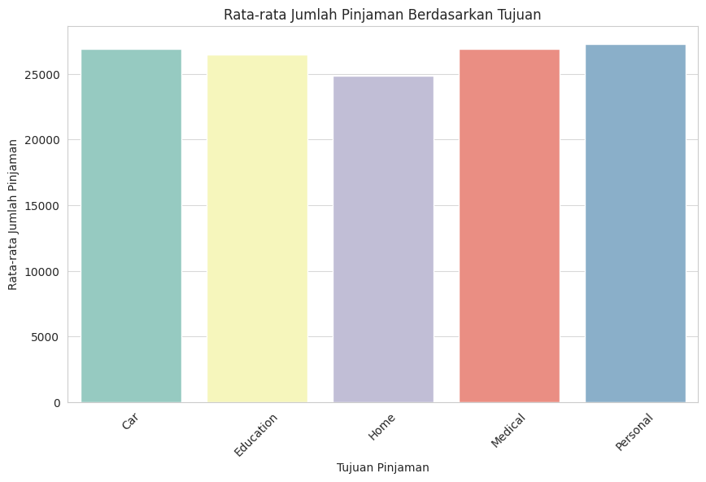
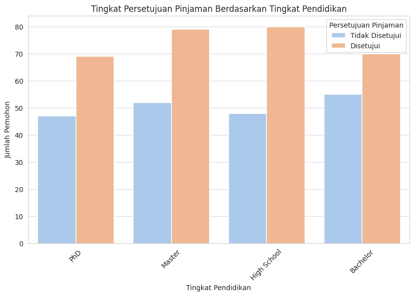

# Tugas-Tuning-Model

Nama  : Iksan Nur Afiah\
NIM   : 4112322009

## Dataset

Dataset tersebut berisi informasi tentang persetujuan pinjaman dengan 500 entri dan 7 kolom. Berikut adalah deskripsi setiap kolom:
1. `Age` (*int64*) - Usia pemohon pinjaman.
2. `Income` (*int64*) - Pendapatan tahunan pemohon dalam satuan mata uang tertentu.
3. `Education_Level` (*object*) - Tingkat pendidikan pemohon (misalnya, High School, Master, PhD).
4. `Credit_Score` (*int64*) - Skor kredit pemohon.
5. `Loan_Amount` (*int64*) - Jumlah pinjaman yang diajukan.
6. `Loan_Purpose` (*object*) - Tujuan peminjaman (misalnya, Personal, Home, Car).
7. `Loan_Approval` (*int64*) - Status persetujuan pinjaman (0 = ditolak, 1 = disetujui).

## 1. Eksplorasi Data  

### Identifikasi apakah terdapat missing values dalam dataset. 

Berdasarkan hasil analisis tidak ditemukan nilai yang hilang (missing values) dalam dataset. Setiap kolom, termasuk `Age`, `Income`, `Education_Level`, `Credit_Score`, `Loan_Amount`, `Loan_Purpose`, dan `Loan_Approval`, memiliki jumlah nilai kosong sebanyak 0. Ini berarti dataset bersih dan tidak memerlukan penanganan tambahan untuk mengatasi missing values.

### Visualisasikan data tersebut

#### A. Distribusi Usia Pemohon

Histogram di atas menunjukkan distribusi usia pemohon dalam sebuah dataset. Rentang usia pemohon berkisar antara 18 hingga 64 tahun, dengan variasi frekuensi di setiap kelompok usia. Terdapat beberapa puncak yang menunjukkan kelompok usia dengan jumlah pemohon lebih tinggi, terutama di sekitar usia 18-20 tahun, 40-an, dan 50-an. Sementara itu, rentang usia 30-an hingga awal 40-an memiliki jumlah pemohon yang relatif lebih sedikit. Distribusi ini menunjukkan bahwa tidak ada pola normal yang jelas, tetapi ada kecenderungan beberapa kelompok usia lebih dominan dalam pengajuan permohonan. Informasi ini dapat digunakan untuk analisis lebih lanjut, misalnya dalam memahami profil demografis pemohon yang lebih sering mengajukan pinjaman.

#### B. Hubungan Skor Kredit dengan Persetujuan Pinjaman

Boxplot di atas menggambarkan hubungan antara skor kredit dengan status persetujuan pinjaman. Sumbu X menunjukkan status persetujuan pinjaman, di mana 0 berarti pinjaman tidak disetujui dan 1 berarti pinjaman disetujui, sedangkan sumbu Y menunjukkan skor kredit pemohon. Dari diagram ini, terlihat bahwa distribusi skor kredit antara kedua kelompok relatif mirip, dengan rentang skor yang luas dari sekitar 300 hingga lebih dari 800. Median skor kredit untuk pemohon yang disetujui dan tidak disetujui berada di sekitar 600, menunjukkan bahwa skor kredit yang lebih tinggi umumnya dikaitkan dengan peluang persetujuan pinjaman yang lebih besar. Namun, terdapat variasi yang signifikan dalam kedua kelompok, dengan beberapa pemohon dengan skor rendah tetap mendapatkan persetujuan, serta beberapa pemohon dengan skor tinggi yang tidak disetujui. Hal ini menunjukkan bahwa selain skor kredit, faktor lain mungkin turut memengaruhi keputusan persetujuan pinjaman.

#### C. Pendapatan vs Jumlah Pinjaman

Scatter plot di atas menunjukkan hubungan antara pendapatan pemohon dengan jumlah pinjaman yang diajukan, dengan warna yang membedakan status persetujuan pinjaman. Sumbu X merepresentasikan pendapatan pemohon, sementara sumbu Y menunjukkan jumlah pinjaman yang diajukan. Titik-titik berwarna biru mewakili pemohon yang pinjamannya disetujui (1), sedangkan titik merah menunjukkan pinjaman yang tidak disetujui (0). Dari pola distribusi, terlihat bahwa persetujuan pinjaman tidak bergantung secara langsung hanya pada pendapatan atau jumlah pinjaman. Pemohon dengan pendapatan tinggi masih bisa mengalami penolakan, dan sebaliknya, pemohon dengan pendapatan lebih rendah masih memiliki peluang mendapatkan persetujuan. Namun, ada kecenderungan bahwa pemohon dengan pendapatan lebih tinggi memiliki lebih banyak pinjaman yang disetujui. Hal ini menunjukkan bahwa selain pendapatan dan jumlah pinjaman, ada faktor lain yang turut memengaruhi keputusan persetujuan pinjaman.

#### D. Jumlah Pinjaman Berdasarkan Tujuan

Grafik di atas menunjukkan rata-rata jumlah pinjaman berdasarkan tujuan pinjaman. Sumbu X merepresentasikan kategori tujuan pinjaman, yaitu Car (mobil), Education (pendidikan), Home (rumah), Medical (medis), dan Personal (pribadi). Sementara itu, sumbu Y menunjukkan rata-rata jumlah pinjaman yang diajukan untuk masing-masing kategori. Dari grafik, terlihat bahwa kategori Personal dan Medical memiliki rata-rata jumlah pinjaman tertinggi, diikuti oleh Car dan Education, sementara kategori Home memiliki rata-rata jumlah pinjaman yang sedikit lebih rendah dibanding kategori lainnya. Hal ini mengindikasikan bahwa pemohon cenderung mengajukan pinjaman dalam jumlah besar untuk keperluan pribadi dan medis, kemungkinan karena kebutuhan mendesak atau fleksibilitas penggunaan dana. Sementara itu, pinjaman untuk perumahan sedikit lebih rendah dalam rata-rata jumlahnya, yang mungkin menunjukkan bahwa pembiayaan rumah sering kali melibatkan sumber pendanaan lain atau skema pembiayaan khusus.

#### E. Tingkat Persetujuan Pinjaman Berdasarkan Tingkat Pendidikan

Grafik di atas menunjukkan tingkat persetujuan pinjaman berdasarkan tingkat pendidikan pemohon. Sumbu X merepresentasikan tingkat pendidikan, yaitu PhD, Master, High School, dan Bachelor, sedangkan sumbu Y menunjukkan jumlah pemohon. Warna biru menunjukkan jumlah pemohon yang tidak disetujui, sementara warna oranye menunjukkan jumlah pemohon yang disetujui.

Dari grafik, terlihat bahwa pada setiap tingkat pendidikan, jumlah pinjaman yang disetujui lebih tinggi dibandingkan dengan yang tidak disetujui. Pemohon dengan tingkat pendidikan High School memiliki jumlah persetujuan pinjaman tertinggi, diikuti oleh Master dan Bachelor, sedangkan PhD memiliki jumlah pemohon yang relatif lebih sedikit tetapi tetap menunjukkan tingkat persetujuan yang tinggi. Hal ini dapat mengindikasikan bahwa tingkat pendidikan berkontribusi pada kemungkinan persetujuan pinjaman, tetapi bukan satu-satunya faktor penentu.

## 2. Pemrosesan Data 

### Lakukan encoding pada fitur kategorikal 

Label Encoding digunakan untuk mengonversi fitur kategorikal menjadi nilai numerik menggunakan `LabelEncoder()` dari `sklearn.preprocessing`.  
Fitur yang dikenakan Label Encoding adalah:  

1. `Education_Level` (Tingkat Pendidikan)
2. `Loan_Purpose` (Tujuan Pinjaman)

### Lakukan feature scaling pada fitur numerik 

Feature Scaling digunakan untuk menstandarisasi fitur numerik menggunakan `StandardScaler` dari `sklearn.preprocessing`.  
Fitur yang dikenakan Standard Scaling:  

1. `Age` (Usia)
2. `Income` (Pendapatan)
3. `Credit_Score` (Skor Kredit) 
4. `Loan_Amount` (Jumlah Pinjaman)
5. 
Metode StandardScaler bekerja dengan mengubah setiap fitur agar memiliki rata-rata (mean) 0 dan standar deviasi 1, sehingga distribusi data menjadi lebih seimbang.

### Bagi dataset menjadi training set (80%) dan testing set (20%).

Dataset dibagi menjadi data training (80) dan data testing (20%) menggunakan `train_test_split`. 

- X (Fitur): `Age`, `Income`, `Education_Level`, `Credit_Score`, `Loan_Amount`, `Loan_Purpose`. 
- y (Target): `Loan_Approval` (status persetujuan pinjaman). 

## 3. Pemilihan dan Training Model 

### Pilih minimal dua algoritma Machine Learning yang berbeda. Jelaskan alasan pemilihan tersebut.

Berikut lima algoritma Machine Learning yang saya pilih, beserta alasan pemilihannya:

1. Logistic Regression digunakan sebagai baseline karena sederhana, cepat, dan cocok untuk hubungan linear antara fitur dan target.  
2. Decision Tree dipilih karena mudah dipahami, tidak memerlukan feature scaling, dan dapat menangani data non-linear, meskipun rentan terhadap overfitting.  
3. Random Forest digunakan karena lebih stabil dan akurat dibanding Decision Tree, serta lebih tahan terhadap overfitting dengan metode ensemble.  
4. XGBoost dipilih karena lebih cepat dan akurat, mampu menangani outlier dan missing values, tetapi memerlukan tuning hyperparameter.  
5. SVM digunakan karena efektif untuk data berdimensi tinggi dan non-linear, tetapi kurang efisien pada dataset besar.

### Lakukan training model menggunakan dataset yang telah diproses.

Proses pelatihan dan evaluasi model machine learning dilakukan dengan menggunakan data pelatihan (`X_train`, `y_train`) dan data uji (`X_test`, `y_test`). Dalam prosesnya, setiap model dalam dictionary `models` dilatih menggunakan metode `.fit()`, kemudian melakukan prediksi terhadap data uji dengan `.predict()`.  

Setelah mendapatkan hasil prediksi, model dievaluasi menggunakan beberapa metrik performa, yaitu accuracy (akurasi), precision (presisi), recall, dan F1-score. Nilai dari setiap metrik tersebut dihitung dengan membandingkan hasil prediksi dengan nilai sebenarnya (`y_test`).  

Hasil evaluasi dari masing-masing model kemudian disimpan dalam daftar `evaluation_results`, yang berisi nama model serta skor dari masing-masing metrik evaluasi. Data ini dapat digunakan untuk membandingkan performa berbagai model dan memilih yang terbaik.

## 4. Evaluasi Model 

### Hitung dan bandingkan metric evaluasi dari kedua model yang dipilih. 

| Model               | Accuracy | Precision | Recall  | F1 Score |
|---------------------|----------|-----------|---------|----------|
| Logistic Regression | 0.64     | 0.636364  | 1.000000 | 0.777778 |
| Decision Tree       | 0.60     | 0.709091  | 0.619048 | 0.661017 |
| Random Forest      | 0.55     | 0.640625  | 0.650794 | 0.645669 |
| XGBoost            | 0.56     | 0.666667  | 0.603175 | 0.633333 |
| SVM                | 0.63     | 0.630000  | 1.000000 | 0.773006 |

Output tersebut menampilkan hasil evaluasi berbagai model machine learning berdasarkan metrik Accuracy, Precision, Recall, dan F1 Score. Dari hasil evaluasi dapat dsimpulkan:

* Logistic Regression dan SVM memiliki Recall tertinggi (1.0), menunjukkan bahwa model ini sangat baik dalam mendeteksi kelas positif.
* Logistic Regression memiliki F1 Score tertinggi (0.7778), diikuti oleh SVM (0.7730), yang menunjukkan keseimbangan antara Precision dan Recall.
* Decision Tree dan Random Forest memiliki nilai akurasi lebih rendah dibandingkan model lainnya.
* XGBoost memiliki Precision tertinggi (0.6667), tetapi F1 Score-nya lebih rendah dari Logistic Regression dan SVM.

### Pilih model dengan performa terbaik untuk tahap tuning.

Berdasarkan hasil evaluasi, model terbaik dapat ditentukan dengan melihat F1 Score, karena F1 Score merupakan metrik yang menyeimbangkan Precision dan Recall.
Model dengan F1 Score tertinggi adalah Logistic Regression (0.7778), diikuti oleh SVM (0.7730). Sehingga Logistic Regression adalah model terbaik berdasarkan evaluasi ini, karena memiliki keseimbangan terbaik antara Precision dan Recall.

## 5. Tuning Model dengan Grid Search atau Random Search 

### Gunakan Grid Search atau Random Search untuk mencari kombinasi hyperparameter terbaik. 

Hyperparameter tuning menggunakan GridSearchCV akan digunakan pada model Logistic Regression digunakan untuk mencari kombinasi hyperparameter terbaik. Hyperparameter yang diuji:

* C (regularization strength): [0.001, 0.01, 0.1, 1, 10, 100]
* solver (metode optimasi): ['newton-cg', 'lbfgs', 'liblinear', 'sag', 'saga']
* max_iter (jumlah iterasi): [100, 1000, 2500, 5000]

### Tampilkan kombinasi hyperparameter terbaik yang diperoleh.

Hasil pencarian hyperparameter terbaik menunjukkan bahwa kombinasi optimal untuk Logistic Regression adalah C = 0.001, max_iter = 100, dan solver = 'liblinear', yang memberikan performa terbaik berdasarkan evaluasi model.

## 6. Perbandingan Performa Sebelum dan Sesudah Tuning 

### Bandingkan hasil evaluasi model sebelum dan sesudah tuning.  

| Model               | Accuracy | Precision | Recall  | F1 Score |
|---------------------|----------|-----------|---------|----------|
| Logistic Regression | 0.64     | 0.636364  | 1.000000 | 0.777778 |
| Logistic Regression AT | 0.64     | 0.636364  | 1.000000 | 0.777778 |

### Jelaskan apakah tuning berhasil meningkatkan performa model.

Hasil evaluasi menunjukkan bahwa Logistic Regression sebelum dan sesudah hyperparameter tuning (AT) memiliki performa yang sama. Nilai accuracy (0.64), precision (0.636364), recall (1.0), dan F1 score (0.777778) tidak berubah setelah tuning, menandakan bahwa optimasi hyperparameter tidak memberikan peningkatan signifikan pada model.
