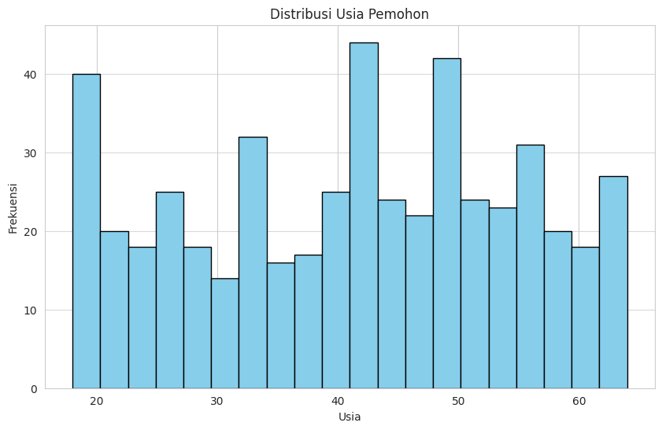

# Tugas-Tuning-Model

## Dataset

Dataset tersebut berisi informasi tentang persetujuan pinjaman dengan 500 entri dan 7 kolom. Berikut adalah deskripsi setiap kolom:

1. `Age` (*int64*) - Usia pemohon pinjaman.
2. `Income` (*int64*) - Pendapatan tahunan pemohon dalam satuan mata uang tertentu.
3. `Education_Level` (*object*) - Tingkat pendidikan pemohon (misalnya, High School, Master, PhD).
4. `Credit_Score` (*int64*) - Skor kredit pemohon.
5. `Loan_Amount` (*int64*) - Jumlah pinjaman yang diajukan.
6. `Loan_Purpose` (*object*) - Tujuan peminjaman (misalnya, Personal, Home, Car).
7. `Loan_Approval` (*int64*) - Status persetujuan pinjaman (0 = ditolak, 1 = disetujui).

## 1. Eksplorasi Data  

### Identifikasi apakah terdapat missing values dalam dataset. 

Berdasarkan hasil analisis tidak ditemukan nilai yang hilang (missing values) dalam dataset. Setiap kolom, termasuk `Age`, `Income`, `Education_Level`, `Credit_Score`, `Loan_Amount`, `Loan_Purpose`, dan `Loan_Approval`, memiliki jumlah nilai kosong sebanyak 0. Ini berarti dataset bersih dan tidak memerlukan penanganan tambahan untuk mengatasi missing values.

### Visualisasikan data tersebut

#### A. 

## 2. Pemrosesan Data 

- Lakukan encoding pada fitur kategorikal 
- Lakukan feature scaling pada fitur numerik 
- Bagi dataset menjadi training set (80%) dan testing set (20%).

## 3. Pemilihan dan Training Model 

- Pilih minimal dua algoritma Machine Learning yang berbeda. Jelaskan alasan pemilihan tersebut.
- Lakukan training model menggunakan dataset yang telah diproses.

## 4. Evaluasi Model 

- Hitung dan bandingkan metric evaluasi dari kedua model yang dipilih. 
- Pilih model dengan performa terbaik untuk tahap tuning.

## 5. Tuning Model dengan Grid Search atau Random Search 
- Gunakan Grid Search atau Random Search untuk mencari kombinasi hyperparameter terbaik. 
- Tampilkan kombinasi hyperparameter terbaik yang diperoleh.

## 6. Perbandingan Performa Sebelum dan Sesudah Tuning 

- Bandingkan hasil evaluasi model sebelum dan sesudah tuning.  
- Jelaskan apakah tuning berhasil meningkatkan performa model.
